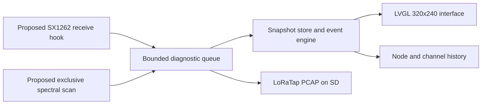

# Lilyshark

**A watch-only Meshtastic field analyzer for the LILYGO T-Deck.**

[](#project-status)
[](#target-hardware)
[](https://lvgl.io/)
[](LICENSE)

Lilyshark is being built to turn a second T-Deck into a dedicated instrument for understanding a Meshtastic network. It will watch packet traffic, radio activity, node health, routing metadata, and failures on the device itself.

> Lilyshark diagnoses the mesh. Messaging stays on the client you already use.

Today this repository contains the working UI simulator. Flashable firmware and live radio capture have not been implemented yet.

The product direction is closer to a pocket Wireshark than another chat client. The intended field setup uses one device for normal Meshtastic messaging and a second device running Lilyshark beside it. The messenger keeps working as usual while Lilyshark observes the same RF environment and helps explain what the network is doing.

## Why Lilyshark

Meshtastic users already have capable messaging clients. When a mesh becomes unreliable, those clients usually show the symptom: a delayed packet, a missing node, or a failed message. They cannot show the surrounding RF activity or how link quality changed before the failure.

Lilyshark is being built for that investigation. It will keep recent signal and node history, turn changes into an event timeline, expose individual packet metadata, and provide a direct view of spectrum activity. Because it has no chat workflow, the whole interface can stay focused on diagnosis.

## What works today

The simulator implements all nine primary views in LVGL 9.3.0. It includes keyboard navigation, embedded fonts, semantic states, dense tables, line plots, a canvas-based waterfall, and deterministic sample telemetry.

<table>
  <tr>
    <td width="50%"></td>
    <td width="50%"></td>
  </tr>
  <tr>
    <td align="center"><sub>Working simulator: live-traffic view</sub></td>
    <td align="center"><sub>Working simulator: spectrum view</sub></td>
  </tr>
</table>

## What it will look like

The interface is designed for the T-Deck's 320x240 display. It uses dense telemetry, high-contrast selection, compact plots, and a fixed status strip instead of a card-based phone UI.

<p align="center">
  
</p>

<p align="center"><sub>Target product direction: a full-width spectrum waterfall with noise-floor, busiest-frequency, and quietest-frequency summaries.</sub></p>

<table>
  <tr>
    <td width="50%"></td>
    <td width="50%"></td>
  </tr>
  <tr>
    <td align="center"><sub>Live packet feed with an obvious focused row</sub></td>
    <td align="center"><sub>Per-node SNR, RSSI, hop count, and last known position</sub></td>
  </tr>
</table>

These are target hardware mockups. All ten references are documented in [design/references](design/references/README.md). Two references explore alternate node-roster density, which is why the design folder contains ten images while the simulator has nine primary screens.

## What Lilyshark is being built to answer

- Is the channel crowded, noisy, or experiencing a burst of interference?
- Which nodes are becoming harder to hear?
- Did a node disappear, or has it simply gone quiet?
- How many hops did a packet take, and what routing metadata is available?
- Are CRC failures or weak links increasing?
- Which frequency is busiest, and where is the quietest part of the band?
- What happened just before a message failed to arrive?
- Can the raw traffic be saved for deeper inspection in Wireshark?

## Planned diagnostic views

| View | Purpose |
| --- | --- |
| **Live traffic** | A dense, scrolling feed of received packets with source, destination, port, hops, RSSI, and SNR. |
| **Packet detail** | Routing metadata when available, decoded fields, payload summary, raw bytes, CRC state, and radio conditions for one frame. |
| **Spectrum** | A color waterfall built from SX1262 spectral-scan data, with fast narrow scans and full-band scans. |
| **Channel utilization** | Noise floor, recent peak usage, and a frequency-by-frequency activity histogram. |
| **Node roster** | Last-seen time, battery state, and a compact signal-history sparkline for every observed node. |
| **Node detail** | Longer SNR, RSSI, and hop-count histories plus the selected node's last known position. |
| **Events** | New nodes, lost nodes, high utilization, interference spikes, and other changes worth investigating. |
| **Survey** | A timed field capture that summarizes nodes heard, best link quality, and local noise. |
| **Map** | A simple field-oriented spatial view of known node positions and distances. |

## Product rules

### Watch-only

The target firmware will compile with radio transmission disabled, and an automated test will verify that transmit attempts are rejected. Receiver-only behavior is a design invariant that still needs validation on hardware.

### Useful beside every messenger

Lilyshark is a companion tool. It is intended to sit beside the Meshtastic client already in use and observe a separately configured T-Deck on the same mesh.

### Explicit mesh configuration

The diagnostic T-Deck must use the same region and modem preset as the mesh it is monitoring. Decoding encrypted application payloads also requires the relevant channel configuration and keys. The setup flow is still to be designed; it must make the active region, preset, frequency, channel, and decode state visible so an operator can tell whether Lilyshark is listening to the intended network.

### Data gets the screen

Plots, packet rows, and state changes take priority over branding and decorative chrome. The visual system uses a near-black field, condensed labels, monospaced telemetry, one-pixel rules, and semantic color:

- Lime: healthy, live, or selected data
- Cyan: information and navigation
- Amber: congestion or warning
- Coral: loss or fault

### On-device first, desktop when needed

The common answers should be visible in the field without opening a laptop. Proposed LoRaTap PCAP export to SD is intended to support deeper inspection with Wireshark after a capture; the exact metadata mapping still needs implementation and validation.

## Target architecture

The final firmware will live in a small, feature-gated module inside a Meshtastic firmware fork. Radio callbacks will copy data into bounded queues. The UI will read stable snapshots rather than touching Meshtastic state directly.



The proposed spectrum scanner needs exclusive ownership of the SX1262. The radio scheduler must pause normal receive work, run the scan, restore the LoRa configuration on every exit path, and then resume monitoring. This design still needs to be integrated and proven on hardware.

## Project status

This repository is currently the UI and interaction prototype. It does **not** yet contain flashable T-Deck firmware or live radio integration.

| Area | Status |
| --- | --- |
| Nine-screen 320x240 LVGL simulator | Working |
| Reference-driven theme and embedded fonts | Working |
| Keyboard navigation and direct screen launch | Working |
| Meshtastic firmware fork and T-Deck hardware shell | Next |
| Raw receive capture and diagnostic snapshot store | Planned |
| Exclusive spectrum-scan scheduler | Planned |
| LoRaTap PCAP export to SD | Planned |
| On-device screenshot capture | Planned |
| Hardware tests and long-running stability work | Planned |

## Roadmap

- [x] Establish the visual contract and build all primary simulator screens.
- [ ] Create the Meshtastic-based `LILYSHARK` firmware target.
- [ ] Bring up the T-Deck display, keyboard, trackball, SD card, GPS, and power status.
- [ ] Enforce the receiver-only build and add a test that rejects transmit attempts.
- [ ] Connect raw RX frames to a bounded capture queue, including CRC failures.
- [ ] Add node snapshots, time-series history, and event detection.
- [ ] Add fast narrow-band and full-band SX1262 spectrum scans.
- [ ] Implement and validate LoRaTap PCAP export for Wireshark.
- [ ] Add screenshot-to-SD and capture-session export.
- [ ] Test memory use, radio recovery, task stacks, and overnight stability on hardware.

## Run the current simulator

The checked-in PlatformIO environment currently targets x86_64 macOS and uses SDL2 from `/usr/local`. It is pinned to LVGL 9.3.0 to match the intended Meshtastic T-Deck UI stack.

Prerequisites:

- macOS with Rosetta available for the x86_64 build
- [`uv`](https://docs.astral.sh/uv/) for the pinned PlatformIO invocation
- SDL2 with `/usr/local/bin/sdl2-config` available

```sh
uvx --from platformio==6.1.19 platformio run -e simulator
.pio/build/simulator/program
```

Use the arrow keys to move between views. Number keys `1` through `9` open a view directly:

1. Live traffic
2. Spectrum waterfall
3. Node roster
4. Node detail
5. Packet detail
6. Node map
7. Survey capture
8. Events
9. Channel utilization

Pass a number on launch to open a specific screen:

```sh
.pio/build/simulator/program 2
```

## Repository layout

```text
include/theme.h             Shared colors, spacing, typography, and LVGL helpers
src/sim_main.cpp            Simulator shell and all nine diagnostic screens
src/fonts/                  Generated LVGL font sources
assets/fonts/               Original OFL font files and licenses
design/references/          Ten target hardware mockups and their screen map
platformio.ini              Reproducible native simulator environment
```

## Target hardware

- LILYGO T-Deck
- ESP32-S3
- SX1262 LoRa radio
- 320x240 color display
- Keyboard, trackball, GPS, microSD, and PSRAM

Hardware support is planned through a Meshtastic firmware fork so Lilyshark can reuse the proven T-Deck board support, radio driver, and mesh decoder while keeping its diagnostic code isolated.

## License

Lilyshark is licensed under [GPL-3.0](LICENSE). Barlow Condensed and IBM Plex Mono are distributed under the SIL Open Font License; their license texts are included in [assets/fonts](assets/fonts).

Meshtastic and LILYGO are referenced to describe compatibility and target hardware. This project is not presented as an official release from either project.
