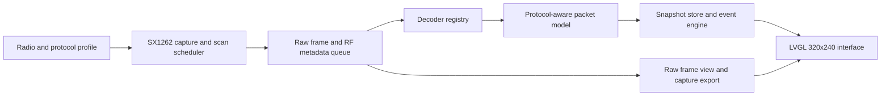

<p align="center">
  
</p>

<h1 align="center">Lilyshark</h1>
<p align="center"><strong>Wireshark for mesh radio, built for the LILYGO T-Deck.</strong></p>

<p align="center">
  <a href="#project-status"></a>
  <a href="#target-hardware"></a>
  <a href="https://lvgl.io/"></a>
  <a href="LICENSE"></a>
</p>

Lilyshark turns a T-Deck into a handheld protocol and RF analyzer. It is being built to capture LoRa traffic, inspect raw frames and radio conditions, decode supported mesh protocols, trace routes and node health, find interference, and export captures for deeper analysis in Wireshark.

Meshtastic, MeshCore, and Reticulum are the first protocol targets. A shared capture core will preserve raw frames and radio metadata, while decoder modules add protocol-specific meaning. The same traffic, spectrum, history, and export tools can then work across multiple mesh stacks.

The product is designed to be useful on one T-Deck for field surveys, radio checks, packet inspection, troubleshooting, and capture. Extra radios are useful for controlled tests and longer observation sessions. They are optional.

> **Current state:** this repository contains the working UI simulator. Hardware capture, protocol decoders, and flashable T-Deck firmware are still in development.

## Why Lilyshark

Mesh failures can start with RF noise, mismatched modem settings, weak links, route changes, congestion, corrupt frames, or protocol behavior. Client apps rarely put all of that evidence in one place.

Lilyshark will bring the useful evidence together on the device: live frames, decoded fields, raw bytes, signal history, node activity, route data, spectrum activity, events, surveys, and capture export. The interface dedicates the screen to understanding what the radio and mesh are doing.

## Protocol roadmap

Radio capture and protocol decoding are separate layers. The capture layer records raw frames and RF context such as frequency, bandwidth, spreading factor, coding rate, RSSI, SNR, and integrity state. Decoder modules add protocol names, node identities, packet types, routes, and readable fields. Frames without a matching decoder remain available as raw bytes and radio metadata.

| Protocol | Direction |
| --- | --- |
| **Meshtastic** | Planned radio profile and packet decoder |
| **MeshCore** | Planned radio profile and packet decoder |
| **Reticulum** | Planned integration for deployments using compatible LoRa interfaces |
| **Other LoRa mesh protocols** | Future decoder modules using the same capture record and decoder API |

These are product targets. The current simulator uses generated, Meshtastic-style sample telemetry. Live protocol integration remains on the roadmap.

## What works today

The simulator implements all nine primary views in LVGL 9.3.0. It includes keyboard navigation, embedded fonts, semantic states, dense tables, line plots, a canvas-based waterfall, and deterministic sample telemetry.

<table>
  <tr>
    <td width="50%"></td>
    <td width="50%"></td>
  </tr>
  <tr>
    <td align="center"><sub>Working simulator: live-traffic view</sub></td>
    <td align="center"><sub>Working simulator: spectrum view</sub></td>
  </tr>
</table>

## What it will look like

The interface is designed for the T-Deck's 320x240 display. It uses dense telemetry, high-contrast selection, compact plots, and a fixed status strip instead of a card-based phone UI.

<p align="center">
  
</p>

<p align="center"><sub>Target product direction: a full-width spectrum waterfall with noise-floor, busiest-frequency, and quietest-frequency summaries.</sub></p>

<table>
  <tr>
    <td width="50%"></td>
    <td width="50%"></td>
  </tr>
  <tr>
    <td align="center"><sub>Live packet feed with an obvious focused row</sub></td>
    <td align="center"><sub>Per-node SNR, RSSI, hop count, and last known position</sub></td>
  </tr>
</table>

These are target hardware mockups. All ten references are documented in [design/references](design/references/README.md). Two references explore alternate node-roster density, which is why the design folder contains ten images while the simulator has nine primary screens.

## What Lilyshark is being built to answer

- What protocol and packet type is this frame?
- Which radio profile is active, and does it match nearby traffic?
- Is the channel crowded, noisy, or experiencing a burst of interference?
- Which nodes or links are becoming harder to hear?
- Did a node disappear, or has it simply gone quiet?
- What route or hop information does this protocol expose?
- Are integrity failures, retries, or weak links increasing?
- Which frequency is busiest, and where is the quietest part of the band?
- What happened just before traffic stopped getting through?
- Can the raw capture be saved for deeper inspection in Wireshark?

## Planned diagnostic views

| View | Purpose |
| --- | --- |
| **Live traffic** | A dense, scrolling feed of frames with protocol, decoded source and destination when available, frame type, routing data, RSSI, and SNR. |
| **Packet detail** | Protocol-specific fields, routing metadata when present, payload summary, raw bytes, integrity state, and radio conditions for one frame. |
| **Spectrum** | A color waterfall built from SX1262 spectral-scan data, with fast narrow scans and full-band scans. |
| **Channel utilization** | Noise floor, recent peak usage, and a frequency-by-frequency activity histogram. |
| **Node roster** | Last-seen time, signal history, and protocol-specific node data such as battery state when available. |
| **Node detail** | Longer SNR and RSSI histories plus route, hop, and position data when the active protocol exposes them. |
| **Events** | New nodes, lost nodes, high utilization, interference spikes, and other changes worth investigating. |
| **Survey** | A timed field capture that summarizes nodes heard, best link quality, and local noise. |
| **Map** | A simple field-oriented spatial view of known node positions and distances. |

## Design principles

### Protocol-aware and extensible

Raw frames and radio metadata belong to the analyzer core. Protocol adapters interpret that data without owning the capture engine or interface. Meshtastic, MeshCore, Reticulum, and future formats share the same traffic, spectrum, event, history, and export tools. Unknown traffic remains visible as raw radio data.

### Useful on one T-Deck

A single T-Deck can run a complete field session: survey the band, inspect traffic, compare radio settings, review node and link history, identify interference, and save a capture. Additional radios can generate controlled traffic or serve as test peers.

### Show the active radio context

The interface must expose the selected region or band, frequency, bandwidth, spreading factor, coding rate, sync word, and protocol profile. Decoding may require protocol settings, channel configuration, or keys. Encrypted payloads can remain opaque while frame and radio metadata stay visible. The setup flow must make the active decoder and decode state clear.

### Data gets the screen

Plots, packet rows, and state changes take priority over branding and decorative chrome. The visual system uses a near-black field, condensed labels, monospaced telemetry, one-pixel rules, and semantic color:

- Lime: healthy, live, or selected data
- Cyan: information and navigation
- Amber: congestion or warning
- Coral: loss or fault

### On-device first, desktop when needed

The common answers should be visible in the field without opening a laptop. Capture export to SD will support deeper inspection with desktop tools such as Wireshark. Each protocol still needs a validated PCAP metadata mapping and dissector strategy.

## Target architecture

Lilyshark is designed around a protocol-neutral capture record. The radio layer owns the SX1262 and records raw frames with their RF metadata. A decoder registry turns recognized frames into protocol-aware packet models while preserving every frame for raw inspection and export.



Meshtastic, MeshCore, Reticulum, and future protocols belong in profiles and decoder modules that share one analyzer interface. The proposed spectrum scanner still needs exclusive ownership of the SX1262, reliable configuration restore, and hardware validation.

## Project status

This repository currently contains the UI and interaction prototype. Flashable T-Deck firmware, live radio capture, and production protocol decoders remain on the roadmap.

| Area | Status |
| --- | --- |
| Nine-screen 320x240 LVGL simulator | Working |
| Reference-driven theme and embedded fonts | Working |
| Keyboard navigation and direct screen launch | Working |
| T-Deck hardware shell and SX1262 capture scheduler | Next |
| Raw receive capture and diagnostic snapshot store | Planned |
| Protocol-neutral capture record and decoder API | Planned |
| Meshtastic protocol profile and decoder | Planned |
| MeshCore protocol profile and decoder | Planned |
| Reticulum-compatible LoRa integration | Planned |
| Exclusive spectrum-scan scheduler | Planned |
| Protocol-aware PCAP export to SD | Planned |
| On-device screenshot capture | Planned |
| Hardware tests and long-running stability work | Planned |

## Roadmap

- [x] Establish the visual contract and build all primary simulator screens.
- [ ] Build the T-Deck firmware shell and SX1262 radio scheduler.
- [ ] Bring up the T-Deck display, keyboard, trackball, SD card, GPS, and power status.
- [ ] Define the protocol-neutral capture record and decoder API.
- [ ] Connect raw frames to a bounded capture queue, including integrity failures.
- [ ] Add Meshtastic, MeshCore, and Reticulum profiles and decoders.
- [ ] Add node snapshots, time-series history, and event detection.
- [ ] Add fast narrow-band and full-band SX1262 spectrum scans.
- [ ] Implement and validate protocol-aware PCAP export for Wireshark.
- [ ] Add screenshot-to-SD and capture-session export.
- [ ] Test memory use, radio recovery, task stacks, and overnight stability on hardware.

## Run the current simulator

The checked-in PlatformIO environment currently targets x86_64 macOS and uses SDL2 from `/usr/local`. It is pinned to LVGL 9.3.0 to match the planned T-Deck firmware interface.

Prerequisites:

- macOS with Rosetta available for the x86_64 build
- [`uv`](https://docs.astral.sh/uv/) for the pinned PlatformIO invocation
- SDL2 with `/usr/local/bin/sdl2-config` available

```sh
uvx --from platformio==6.1.19 platformio run -e simulator
.pio/build/simulator/program
```

Use the arrow keys to move between views. Number keys `1` through `9` open a view directly:

1. Live traffic
2. Spectrum waterfall
3. Node roster
4. Node detail
5. Packet detail
6. Node map
7. Survey capture
8. Events
9. Channel utilization

Pass a number on launch to open a specific screen:

```sh
.pio/build/simulator/program 2
```

## Repository layout

```text
include/theme.h             Shared colors, spacing, typography, and LVGL helpers
src/sim_main.cpp            Simulator shell and all nine diagnostic screens
src/fonts/                  Generated LVGL font sources
assets/brand/               Transparent SVG wordmark and color variants
assets/fonts/               Original OFL font files and licenses
design/references/          Ten target hardware mockups and their screen map
platformio.ini              Reproducible native simulator environment
```

## Target hardware

- LILYGO T-Deck
- ESP32-S3
- SX1262 LoRa radio
- 320x240 color display
- Keyboard, trackball, GPS, microSD, and PSRAM

The T-Deck is Lilyshark's first hardware target. Board support, radio capture, protocol decoding, and the UI remain separate layers so the analyzer can grow across mesh stacks and future compatible hardware.

## License

Lilyshark is licensed under [GPL-3.0](LICENSE). Barlow Condensed and IBM Plex Mono are distributed under the SIL Open Font License; their license texts are included in [assets/fonts](assets/fonts).

Meshtastic, MeshCore, Reticulum, Wireshark, and LILYGO are referenced to describe protocol goals, interoperability, and target hardware. Lilyshark is independent and is not an official release from any of those projects.
