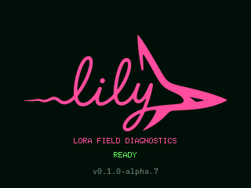
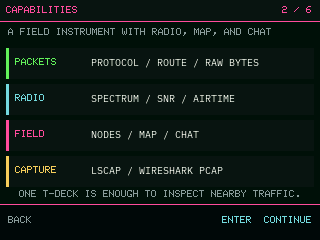
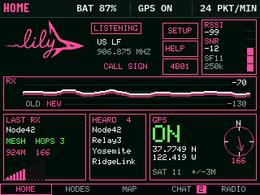
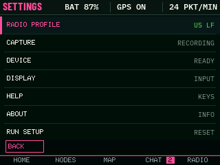
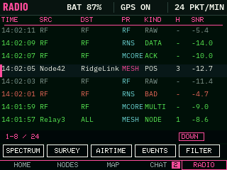
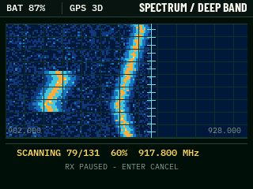
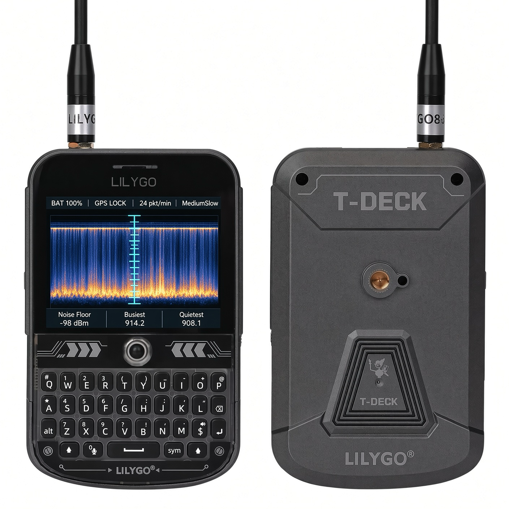
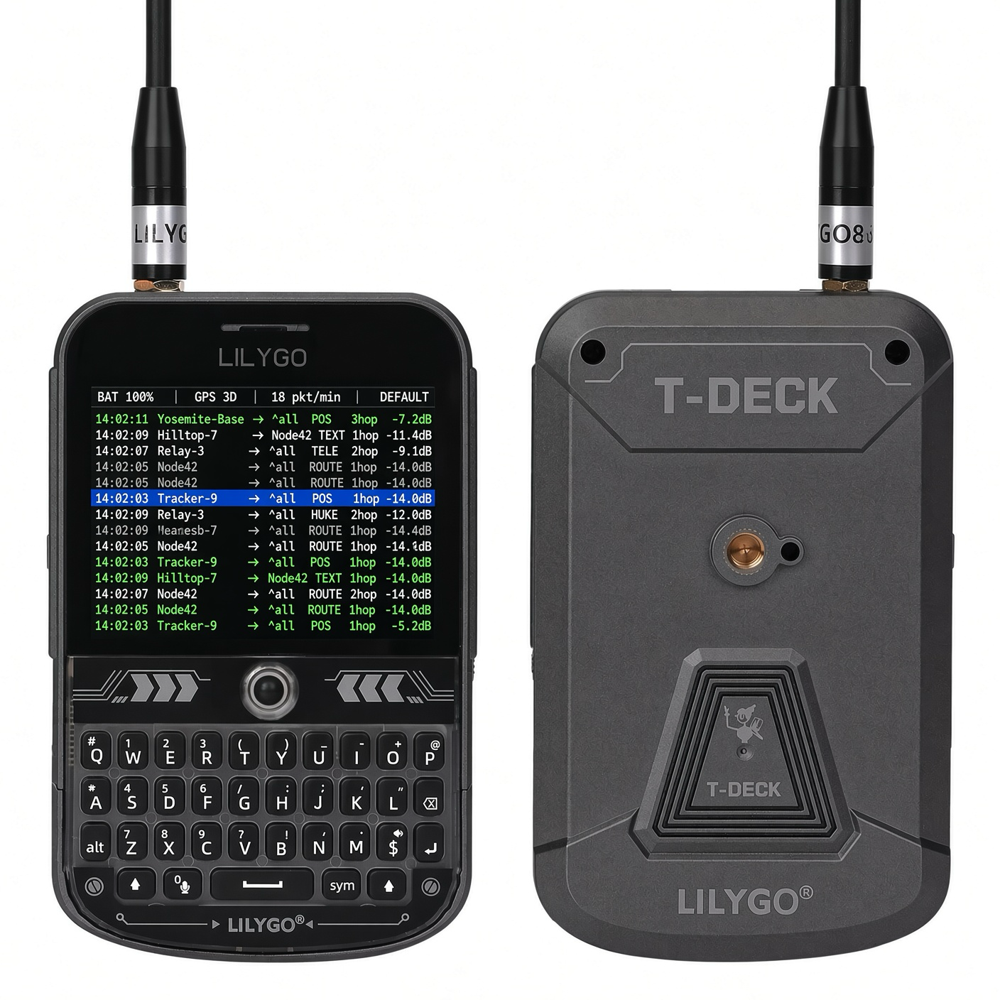
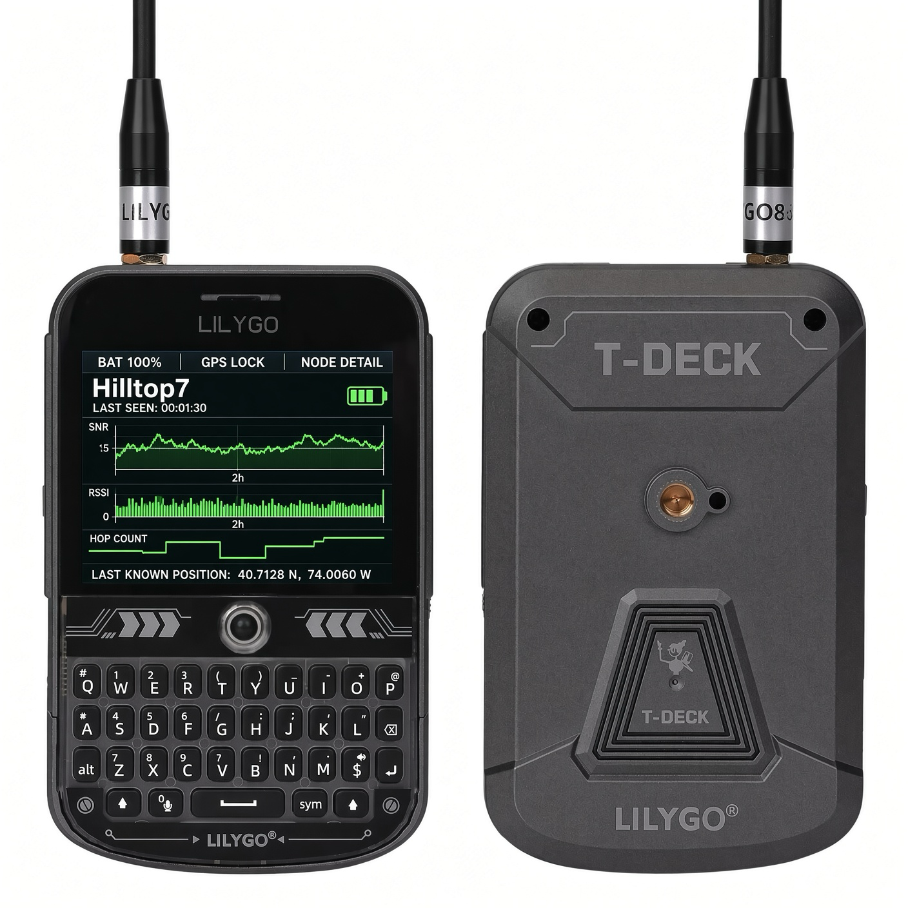
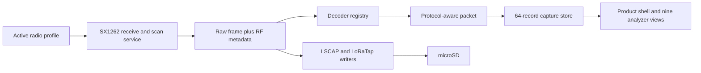

<p align="center">
  
</p>

<h1 align="center">Lilyshark</h1>
<p align="center"><strong>Wireshark for mesh radio, built for the LILYGO T-Deck.</strong></p>

<p align="center">
  <a href="#project-status"></a>
  <a href="#target-hardware"></a>
  <a href="https://lvgl.io/"></a>
  <a href="LICENSE"></a>
</p>

Lilyshark turns a T-Deck into a handheld LoRa traffic and RF analyzer. It captures frames from the SX1262, keeps the raw bytes and radio measurements together, interprets supported mesh headers, tracks what the receiver has heard, surveys the band, and saves evidence to a microSD card.

Meshtastic, MeshCore, and Reticulum-compatible RNode traffic share one capture engine and one interface. Each protocol decoder adds the meaning it can prove from the frame. Unknown or protected data remains available as raw bytes with frequency, bandwidth, spreading factor, coding rate, RSSI, SNR, CRC state, frequency error, and airtime.

A single T-Deck is enough for field surveys, packet inspection, radio-profile checks, interference hunting, and capture. Lilyshark listens to traffic already on the air and gives that traffic a diagnostic interface you can carry.

The firmware is also a complete device shell, not a loose collection of graphs. It boots into the pink Lilyshark wordmark, guides a first-time user through network and radio-profile selection, checks the available hardware, then opens a Home screen with clear routes to live diagnostics and settings. Capture, storage, radio, display, keyboard, optional GPS, Help, About, and setup reset are all controllable on the T-Deck.

> [!WARNING]
> The current firmware is a developer alpha. The simulator, sanitizer-backed host tests, T-Deck build, and merged factory image run successfully in the development environment. No physical T-Deck was connected for the current build pass, so display orientation, touch calibration, radio reception, microSD behavior, optional GPS, battery readings, and spectrum-scan recovery still need a hardware smoke test. Treat the generated image as test firmware until those checks pass.

## Two halves: the device and the analyzer

Lilyshark is firmware plus a web analyzer that reads what the firmware records.

| | Where | What it does |
| --- | --- | --- |
| **Firmware** | `src/`, `include/` | Captures LoRa frames off the SX1262 with their radio measurements. Writes `.lscap` and LoRaTap PCAP to microSD. |
| **Analyzer** | [`webapp/`](webapp/) — live at **[lilyshark.vercel.app](https://lilyshark.vercel.app)** | Opens those captures Wireshark-style: frame list, decoded RF metadata, hex dump, capture statistics. Also indexes the Shelby network. |

## Shelby: storage for captures, and a pointer that fits one LoRa frame

A capture is only worth something if you can prove it is the same bytes the radio
heard, so captures belong in content-addressed storage rather than on a card that
can be edited. Lilyshark uses [Shelby](https://shelby.xyz) for that, and the
analyzer can fetch a capture by Shelby blob name and parse it in the browser.

Reaching Shelby from off-grid needed a design rather than a wire. **A LoRa node has
no IP path, so it cannot call Shelby.** It does not need to: the mesh moves ~200
usable bytes per frame, far too small for a payload and far larger than a blob
reference. So the radio carries an 82-byte **Shelby pointer** and a node with
connectivity moves the bytes.

```
include/lilyshark/shelby/shelby_pointer.h    82-byte wire format, magic "SHLB"
src/shelby/shelby_pointer.cpp                encode / decode / locate
src/shelby/shelby_pointer_decoder.cpp        finds pointers inside captured frames
webapp/src/lib/lscap.ts                      the same format, read in TypeScript
```

The pointer carries a blob commitment, owner account, size, expiry, and chunk
position. It is deliberately **not a new link layer** — it is an application payload
convention, which is why one encoding works inside Meshtastic, MeshCore, and
Reticulum alike, and why a node running stock firmware relays it without knowing
what it is. Decoding rejects inconsistent chunk state, so a receiver can never
mistake one part of a split blob for a complete one. The C++ encoder and the
TypeScript decoder are cross-checked byte for byte.

Keeping the over-the-air object small is a measured decision, not a stylistic one:
against Meshtastic's own discrete-event simulator a flooded mesh spends **R = 7.36**
transmissions per delivered message at realistic density, and reach falls from 68.6%
to 25.8% as nodes are added. Airtime is the scarce resource, so send a reference and
let a connected node carry the payload.

> **Status:** the pointer codec, the cross-protocol decoder, the capture format, and
> the analyzer are built and tested under AddressSanitizer and UndefinedBehaviorSanitizer.
> The gateway that resolves a pointer to and from Shelby over IP is the next piece,
> not a shipped one.

## Download

The public [GitHub Releases page](https://github.com/maxmoneycash/lilyshark/releases) contains the current T-Deck factory image, application-only image, debug symbols, and SHA-256 checksums. For a fresh install, use the [prebuilt-release steps](docs/FLASHING.md#install-the-prebuilt-developer-alpha); a local firmware build is not required. Do not flash the `.elf` file.

## What Lilyshark shows

- A live frame feed with capture time, protocol, source and destination when the protocol exposes them, packet type, route or hop data, and SNR
- Packet detail with decoded header fields, integrity state, available RF metadata, and a raw hex view
- Protocol-aware node activity and short signal histories when a stable node identity is available
- A color spectrum view built from the SX1262 spectral-scan histogram
- Channel activity, observed airtime, packet rate, CRC failures, and recent utilization
- A timed 60-second field survey with frames captured, unique sources, best SNR, and CRC errors
- Local GPS state and position when a compatible receiver is attached
- Operational events for radio state, active profile, capture files, PCAP limits, and screenshots
- Native `.lscap`, LoRaTap PCAP, and 24-bit BMP output on microSD

## Interface

The 320x240 interface gives the display to telemetry. It uses condensed labels, monospaced values, one-pixel rules, compact plots, and high-contrast selection. Lime marks live or healthy data, cyan marks navigation and information, amber marks warnings, and coral marks faults.

These images come from the working LVGL simulator and use the exact 320x240 device layout:

<table>
  <tr>
    <td width="50%"></td>
    <td width="50%"></td>
  </tr>
  <tr>
    <td align="center"><sub>First visible frame</sub></td>
    <td align="center"><sub>Guided first-run setup</sub></td>
  </tr>
  <tr>
    <td></td>
    <td></td>
  </tr>
  <tr>
    <td align="center"><sub>Home</sub></td>
    <td align="center"><sub>Settings</sub></td>
  </tr>
</table>

<table>
  <tr>
    <td width="50%"></td>
    <td width="50%"></td>
  </tr>
  <tr>
    <td align="center"><sub>Live traffic</sub></td>
    <td align="center"><sub>Spectrum</sub></td>
  </tr>
</table>

The hardware mockups below define the visual target for the T-Deck build:

<p align="center">
  
</p>

<table>
  <tr>
    <td width="50%"></td>
    <td width="50%"></td>
  </tr>
  <tr>
    <td align="center"><sub>Dense frame feed with a clear focused row</sub></td>
    <td align="center"><sub>Per-node signal, hop, activity, and position detail</sub></td>
  </tr>
</table>

All ten reference images and their screen mapping live in [design/references](design/references/README.md).

### Product shell

On a fresh install, Lilyshark follows this path:

1. Show the antialiased pink wordmark before the backlight reveals the application UI.
2. Ask which mesh family the operator intends to inspect.
3. Choose and apply a matching radio preset.
4. Report input, microSD, optional GPS, radio, and capture readiness honestly.
5. Save first-run completion only after the settings write succeeds.
6. Open Home, where every live view and Settings is reachable without memorizing keys.

Returning users can start at Home or resume the last live view. Settings exposes the active radio profile, capture and storage state, device status, display brightness, keyboard light, optional GPS polling, startup behavior, Help, About, and a guarded setup reset. Failed persistence rolls the visible value back instead of pretending it was saved.

### Analyzer views

| Route | View | Current device behavior |
| ---: | --- | --- |
| `1` | **Traffic** | Shows captured frames from the bounded in-memory store. Up/Down selects a row; Enter opens it. |
| `2` | **Spectrum** | Runs and renders an SX1262 power-histogram sweep for the active profile's band. |
| `3` | **Nodes** | Lists observed protocol identities and signal history. Up/Down selects a row; Enter opens it. |
| Traffic → Enter | **Packet detail** | Shows protocol fields, RF measurements, integrity state, and every captured raw byte in bounded 40-byte pages. |
| Nodes → Enter | **Node detail** | Summarizes recent frames, SNR, RSSI, and activity for an observed source. |
| `4` | **Map** | Shows the local optional-GPS fix and distinguishes GPS Off, missing hardware, search, and fix states. |
| `5` | **Survey** | Captures a 60-second diagnostic sample and reports observed results. |
| `6` | **Airtime** | Summarizes observed airtime, frame rate, CRC failures, and recent activity. |
| `7` | **Events** | Reports radio, profile, capture, PCAP, screenshot, settings, and hardware state in a scrollable history. |

`8` opens Settings. `M` or `0` opens Home. Left and Right move through the seven primary live views; reaching either end returns to Home instead of wrapping invisibly.

The simulator fills these views with deterministic example data. The T-Deck target uses captured data or an explicit unavailable state.

## Protocol coverage

Decoding is profile-gated because these LoRa protocols do not all carry an unambiguous magic value. Press `P` on the T-Deck to open the radio-profile picker. Use `-`/`+`, `B`, `F`, and `C` to tune its frequency, bandwidth, spreading factor, and coding rate for the network in front of you. The active preset and tuned values are saved across restarts. Lilyshark reconfigures the SX1262 transactionally and uses the matching structural decoder.

| Protocol | Included profiles | Fields decoded today | Current boundary |
| --- | --- | --- | --- |
| **Meshtastic** | US LongFast, 906.875 MHz, 250 kHz, SF11, CR 4/5 | Outer header, source, destination, packet ID, channel hash/hint, hop limit/start, next hop, relay byte, broadcast/ACK/MQTT flags | Protobuf payload stays opaque. The outer header alone does not prove whether it is clear or encrypted; channel keys and payload decryption are not implemented. |
| **MeshCore** | Current US recommendation at 910.525 MHz/62.5 kHz/SF7; legacy 915 MHz/250 kHz/SF10 | Version 1 route type, payload type, encoded path shape, transport codes, group channel, ACK checksum, structural length validation | Protected direct, group, and anonymous payloads stay opaque. Advertisement bodies are not expanded into contacts. |
| **Reticulum / RNode** | Documented EU example at 867.2 MHz plus a tunable 915 MHz US starting point, both 125 kHz/SF8 | RNode shim, split marker, Reticulum header type, packet and destination type, context, hops, hash prefixes, outer-header protection marker | RNode PHY settings are deployment-defined. IFAC-marked content stays opaque and unverified without an interface key. The included profiles are starting points, not universal Reticulum channels. |
| **Unknown LoRa** | User code can add `RadioProfile` entries | Raw frame, integrity state, and all RF metadata supplied by the radio | No protocol labels are invented. The frame is still inspectable and exportable. |

The decoder API preserves uncertainty. MeshCore transport codes are not presented as node IDs, and Reticulum's 32-bit hash prefixes are not presented as complete identities.

### Built-in PHY profiles

| ID | Name in firmware | Center frequency | Bandwidth | SF | CR | Sync word | Preamble |
| ---: | --- | ---: | ---: | ---: | ---: | ---: | ---: |
| 1 | `MESHTASTIC US LF` | 906.875 MHz | 250 kHz | 11 | 4/5 | `0x2B` | 16 symbols |
| 2 | `MESHCORE US` | 910.525 MHz | 62.5 kHz | 7 | 4/5 | `0x1424` | 32 symbols |
| 3 | `MESHCORE LEGACY` | 915.000 MHz | 250 kHz | 10 | 4/5 | `0x1424` | 16 symbols |
| 4 | `RNODE EXAMPLE EU` | 867.200 MHz | 125 kHz | 8 | 4/5 | `0x1424` | 18 symbols |
| 5 | `RNODE EXAMPLE US` | 915.000 MHz | 125 kHz | 8 | 4/5 | `0x1424` | 18 symbols |

These are explicit starting profiles, not automatic protocol detection. Choose settings that match the network and comply with the rules for your location before capturing traffic.

## Radio capture and spectrum scanning

The T-Deck target configures the onboard SX1262 for one active profile at a time. Its receive path records valid frames and CRC mismatches, then immediately returns the radio to receive mode. The in-memory UI store holds the newest 64 records while microSD capture keeps writing beyond that window.

Spectrum mode uses the SX1262 spectral-scan patch and reads a 33-bin power histogram at each frequency step. A full US-band request covers 902 through 928 MHz in 200 kHz steps. EU and profile-centered requests use their own range. The scan owns the radio while it runs, then fully reapplies the active receive profile before capture resumes.

This scan facility is marked **experimental** in the firmware. Semtech and RadioLib describe it as experimental, and Lilyshark's restore path has not yet been exercised on a physical T-Deck. The interface reports partial progress, cancellation, timeouts, scan failures, and receive-restoration failures instead of hiding them.

## Capture files and screenshots

Insert a writable microSD card before boot. Lilyshark mounts it, creates `/lilyshark`, and opens unique capture files automatically.

| Output | Path | Use |
| --- | --- | --- |
| Lilyshark capture | `/lilyshark/capture-####.lscap` | Protocol-neutral format that preserves every recorded RF field and supports settings such as 62.5 kHz bandwidth. The version 1 layout is documented in [docs/lilyshark-capture-format.md](docs/lilyshark-capture-format.md). |
| LoRaTap PCAP | `/lilyshark/capture-####.pcap` | Standard PCAP with DLT 270 LoRaTap records for Wireshark and compatible tools. |
| Screenshot | `/lilyshark/screenshot-####.bmp` | Pixel-exact 320x240, uncompressed 24-bit BMP captured from the device display when `S` is pressed. |

LoRaTap v0 cannot represent every bandwidth exactly. The included MeshCore 62.5 kHz profile therefore continues recording `.lscap` while the Events view reports the PCAP bandwidth limit. Profiles at 125 kHz or exact multiples can produce LoRaTap records. Capture sinks flush every five seconds during normal operation. A short write or a post-flush size mismatch closes that file and latches a storage error. After restoring writable storage, open **Settings → Capture & Storage** and retry capture to create new unique files; reboot if the card itself was reinserted after the SPI stack reported a mount failure.

Capture timestamps are monotonic microseconds since boot. That preserves order
and intervals, but the original T-Deck has no dependable real-time clock, so
classic PCAP cannot provide trustworthy wall time yet. Wireshark may display a
1970-era absolute date; use its relative-time columns for these captures.

Validate a capture on the host before processing it:

```sh
python3 scripts/lscap.py validate capture-0001.lscap
```

Dump the file header followed by one JSON object per frame, which works well
with streaming tools such as `jq`:

```sh
python3 scripts/lscap.py dump capture-0001.lscap
```

Use `--pretty` when you want one indented JSON document with a `records` array:

```sh
python3 scripts/lscap.py dump --pretty capture-0001.lscap
```

The reader keeps signed RF values as signed JSON numbers. It also includes the
raw enum and flag values, readable names for known values, unknown flag bits,
reserved bytes, header extensions, and the payload as hexadecimal.

Saving a BMP uses the display and microSD on the shared SPI bus. Reception stays armed, but polling pauses while the image is written, so a busy channel can lose frames. The Events view reports the measured screenshot capture gap.

## Device controls

| Control | Action |
| --- | --- |
| Left/Right or horizontal touch swipe | Move through the seven primary analyzer views; adjust a selected setting where the screen says so |
| Up/Down or vertical touch swipe | Move menu and table focus; page Packet Detail raw bytes and the Events history |
| Trackball press or `Enter` | Open the focused route or record, apply a choice, start a survey, or start/cancel a spectrum sweep |
| `Backspace` | Go back through the product shell or return from a detail view |
| `M` or `0` | Open Home; press again to return to the analyzer |
| `1` through `7` | Open Traffic, Spectrum, Nodes, Map, Survey, Airtime, or Events directly |
| `8` | Open Settings |
| `P` | Open the five-preset radio-profile picker with the active preset focused |
| `-` / `+` | Move the active profile down or up one bandwidth-sized frequency step within its region |
| `B` | Cycle 62.5, 125, 250, and 500 kHz bandwidths |
| `F` | Cycle spreading factors 7 through 12 |
| `C` | Cycle coding rates 4/5 through 4/8 |
| `S` | Save a BMP screenshot to microSD |
| `?` | Open Help without bypassing unfinished onboarding or destructive confirmations |
| Touch tap | Select the tapped menu/table row or invoke the exact left/right action shown in the footer |

The touchscreen probes the GT911 at both T-Deck addresses and reports absence instead of blocking startup. The trackball and keyboard remain available when touch is missing.

## Architecture

The firmware separates raw capture from protocol interpretation. A radio profile defines the LoRa PHY and suggests a decoder. Each received frame enters one protocol-neutral record, passes through the decoder registry, updates the bounded snapshot store, reaches the UI, and is written to the enabled capture sinks.



The scan state machine gives the SX1262 exclusive ownership during a sweep. It has bounded point counts, per-frequency and overall timeouts, cancellation, partial results, and a receive-profile restore step on every exit path.

## Project status

| Area | Evidence in this repository | Physical T-Deck status |
| --- | --- | --- |
| Product shell and analyzer UI | Exact 320x240 framebuffer comparisons cover the pink splash, four-step onboarding, Home, menus, confirmations, and nine analyzer views. Interaction tests cover keyboard, trackball-equivalent navigation, touch hit targets, back-stack behavior, first-run persistence, and failure rollback. | Pending display and input smoke test |
| Embedded wordmark | A generated 264x128 A8 mask keeps the SVG's antialiased edge detail, lives in flash, and is recolored Lily Pink at draw time. A source/payload hash test and device-shell framebuffer check protect the asset. | Pending physical panel confirmation |
| T-Deck hardware target | Pinned PlatformIO builds app, factory, and ELF artifacts. A host test checks every command, data byte, and delay in the panel initialization sequence against LilyGO T-Deck commit `274ddaa`. TFT_eSPI 2.5.43 is pinned with the upstream one-line SPI2 register fix at [`880ec0e`](https://github.com/maxmoneycash/TFT_eSPI/commit/880ec0e4657c0de56d28cc250bdbbe863386021e), and a compile-time guard rejects an invalid ESP32-S3 register base. The device shell also runs against host peripheral fakes. | Boot and panel output not yet observed on hardware |
| SX1262 frame capture | The real radio service runs against host fakes covering configure, IRQ/read/rearm order, CRC mismatch, retry, scan, restore, and recovery | Reception and long-run recovery pending |
| Meshtastic decoder | Profile-gated outer-header tests, including malformed input | Live over-air sample pending |
| MeshCore decoder | Version 1 structural and malformed-frame tests, including the legal empty `RAW_CUSTOM` form | Live over-air sample pending |
| Reticulum/RNode decoder | Header-one/header-two, IFAC-marker, split, and malformed-frame tests | Live RNode sample pending |
| Radio profile tuning | Sanitizer tests cover regional frequency stepping, BW, SF, CR, and persisted-value validation | Keyboard tuning and restart persistence pending |
| `.lscap` export | Byte-exact writer tests and documented v1 layout | microSD write test pending |
| LoRaTap PCAP | Byte-exact writer tests for the DLT 270 record layout | microSD and desktop-open test pending |
| BMP screenshots | RGB565-to-BMP tests and unique-path device writer | Display readback and microSD test pending |
| Touch, keyboard, and trackball | Input services compile; host tests cover the touch transform and polling deadlines across the 32-bit `millis()` rollover | On-device input, calibration, and interaction tests pending |
| Battery and optional GPS | Battery model tests; TinyGPS++ hardware service compiles | ADC calibration and serial receiver test pending |
| Spectrum scan | Request/result tests plus radio restore state machine | Experimental; complete hardware validation pending |

The standalone C++ tests compile with warnings as errors and run under AddressSanitizer and UndefinedBehaviorSanitizer. The simulator test renders all 24 analyzer and product-shell routes into a full 320x240 RGB565 buffer and checks exact pixels, content thresholds, and uniqueness. The serial checker is fixture-tested and reads without writing to the port. Alpha.7 also executes the real device setup and loop under the sanitizers through host peripheral fakes, including first-frame/backlight ordering, onboarding persistence, missing-hardware recovery, menu navigation, settings rollback, a radio frame flowing into both capture formats and the UI, raw-byte paging, and event-history scrolling. These checks do not replace the pending physical display and input smoke tests. The checked-in GitHub Actions workflow runs the same suite, builds both targets, and uploads firmware artifacts after a successful workflow run.

## Build and test

The tool versions are pinned in the repository. Install [`uv`](https://docs.astral.sh/uv/) so `uvx` can create isolated PlatformIO and esptool environments.

### Run every host test and build both targets

```sh
./scripts/test_all.sh
```

Run the sanitizer-backed C++ tests without PlatformIO builds:

```sh
./scripts/test_all.sh --host-only
```

### Build release artifacts

```sh
./scripts/build_release.sh
```

The release build pins compiler date and time macros to the current Git commit.
To prove determinism on the same host with the pinned toolchain, run two
forced-clean builds and compare every output byte:

```sh
./scripts/verify_reproducible_release.sh
```

GitHub Actions is the canonical release environment (`ubuntu-24.04`). A build
on another operating system can embed different tool paths, so use the tagged
release assets when you need the published checksums exactly.

The script runs the pinned T-Deck build and writes:

```text
dist/lilyshark-tdeck.factory.bin  Complete image for address 0x0
dist/lilyshark-tdeck.bin          Application image for address 0x10000
dist/lilyshark-tdeck.elf          Symbols for debugging
dist/SHA256SUMS                   SHA-256 checksums
```

The equivalent direct firmware build is:

```sh
SOURCE_DATE_EPOCH="$(git log -1 --format=%ct)" \
  uvx --with pip==25.2 --with intelhex==2.3.0 --from platformio==6.1.19 \
  platformio run -e t-deck
```

### Run the simulator

The checked-in simulator environment currently targets x86_64 macOS and resolves `sdl2-config` from `PATH`.

```sh
uvx --from platformio==6.1.19 platformio run -e simulator
.pio/build/simulator/program
```

Pass a view number to open that screen at launch:

```sh
.pio/build/simulator/program 2
```

Render all analyzer and product-shell routes without opening an SDL window and compare their exact
framebuffers with the checked-in expectations:

```sh
.pio/build/simulator/program --render-test
```

Run the automatic presentation tour for a screen recording:

```sh
./scripts/run_ui_demo.sh
```

On macOS, `./scripts/run_ui_demo.sh --record` opens the system screen recorder,
waits 15 seconds, then drives one complete 115-second pass through the real UI
navigation. See the [recording guide](docs/RECORDING_UI.md) for the full shot list
and output options.

Run the simulator as one long-lived process that rebuilds every view once per second. With no argument, the runner stops after 24 hours and fails on an early exit or fatal diagnostic:

```sh
./scripts/soak_simulator.sh       # 24 hours
./scripts/soak_simulator.sh 60    # one-minute check
```

On Apple Silicon with Homebrew:

```sh
brew install sdl2 uv
```

## Flash a T-Deck

The guarded flash script accepts an explicit serial device, verifies the factory image against `SHA256SUMS`, pins esptool 4.11.0, and writes the merged image at `0x0`.

```sh
./scripts/build_release.sh
./scripts/flash_tdeck.sh /dev/cu.usbmodem1101   # macOS example
# ./scripts/flash_tdeck.sh /dev/ttyACM0         # Linux example
```

`./scripts/flash_tdeck.sh --auto` proceeds only when it finds exactly one eligible USB modem or ACM serial device. The script stops when the port, artifact, or checksum is ambiguous. After flashing, `scripts/smoke_tdeck.py` records a bounded 115200-baud startup log and checks the display, touch, storage, radio, and UI milestones without sending data to the device.

Use the factory image for a fresh install. The application-only image at `0x10000` is for updates on a T-Deck that already has the matching Lilyshark bootloader and partition table. Full instructions, serial monitoring, expected files, and recovery boundaries are in [docs/FLASHING.md](docs/FLASHING.md).

## Repository layout

```text
include/lilyshark/core/       Protocol-neutral records, profiles, store, and spectrum model
include/lilyshark/protocols/  Meshtastic, MeshCore, and Reticulum decoder interfaces
include/lilyshark/device/     T-Deck radio, status, touch, screenshot, and SD services
include/lilyshark/export/     LSCAP and LoRaTap writer interfaces
include/lilyshark/shelby/     Shelby off-grid pointer format and its frame decoder
include/lilyshark/ui/         Packet presentation and derived-node policy
src/core/                     Decoder registry, profiles, decoders, and spectrum helpers
src/device/                   ESP32-S3 and T-Deck hardware implementations
src/export/                   Capture encoders
src/shelby/                   Shelby pointer encode, decode, and in-frame detection
webapp/                       Web analyzer and Shelby network dashboard (Vite + React)
webapp/src/lib/lscap.ts       .lscap and Shelby-pointer readers, matching the firmware
src/ui/                       Shared packet labels and UI admission rules
src/sim_main.cpp              Shared LVGL screens plus simulator and T-Deck shells
src/fonts/                    Generated LVGL font sources
test/                         Sanitizer-backed host tests
scripts/                      Test, release-build, factory-image, and safe-flash tooling
assets/brand/                 Pink transparent SVG wordmark and monochrome variants
assets/device/                Embedded-wordmark generation notes and placement contract
design/previews/              Captures from the working simulator
design/references/            Ten target hardware mockups and their screen map
docs/                         Capture format and flashing documentation
.github/workflows/            Reproducible test and firmware artifact build
```

## Target hardware

- LILYGO T-Deck with ESP32-S3 and SX1262
- 320x240 ST7789 color display
- Built-in keyboard, trackball, GT911 touch controller, and PSRAM
- Writable microSD card for capture and screenshots
- Optional GPS receiver on the T-Deck serial pins
- An antenna suited to the frequencies you configure

The T-Deck is the first hardware target. The capture record, decoder registry, and export formats stay independent of its display and input services so future compatible LoRa hardware can reuse the analyzer core.

## Roadmap to a stable release

- [x] Build all nine reference-driven analyzer screens.
- [x] Add the pink device splash, four-step onboarding, Home, Settings, Help, About, and guarded confirmations.
- [x] Persist first-run, brightness, capture, GPS, and startup preferences with CRC validation and failure rollback.
- [x] Add the ESP32-S3/T-Deck target and reproducible factory image.
- [x] Capture SX1262 frames and CRC mismatches with configured channel settings, measured signal metrics, and explicit-header coding-rate/CRC metadata.
- [x] Add profile-gated structural decoders for Meshtastic, MeshCore, and Reticulum/RNode.
- [x] Add persistent on-device frequency, bandwidth, spreading-factor, and coding-rate tuning.
- [x] Add `.lscap`, LoRaTap PCAP, and BMP output on microSD.
- [x] Add keyboard, trackball, GT911 touch, battery, and optional-GPS services.
- [x] Add an interruptible SX1262 spectral-scan state machine with receive restoration.
- [x] Add sanitizer-backed host tests and a two-target GitHub Actions build.
- [ ] Boot the factory image on a physical T-Deck and verify every hardware service.
- [ ] Capture known Meshtastic, MeshCore, and RNode fixtures over the air and compare bytes with desktop captures.
- [ ] Calibrate touch orientation, battery voltage, and spectral power against known references.
- [ ] Exercise scan cancellation, SD removal, CRC bursts, missing peripherals, and radio recovery.
- [ ] Run an overnight capture and spectrum endurance test on hardware.
- [ ] Add sync-word/preamble editing, key management, deeper payload decoders, and more regional presets.
- [ ] Publish a hardware-validated tagged release with checksums and a field-test report.

## License and project names

Lilyshark is licensed under [GPL-3.0](LICENSE). Barlow Condensed and IBM Plex Mono are distributed under the SIL Open Font License; their license texts are included in [assets/fonts](assets/fonts).

Meshtastic, MeshCore, Reticulum, RNode, Wireshark, and LILYGO are referenced to describe compatibility, protocol coverage, and target hardware. Lilyshark is an independent project and is not an official release from those projects.
