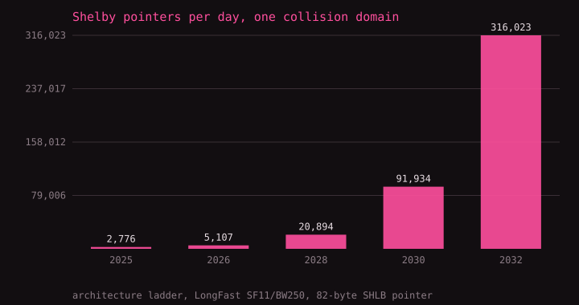
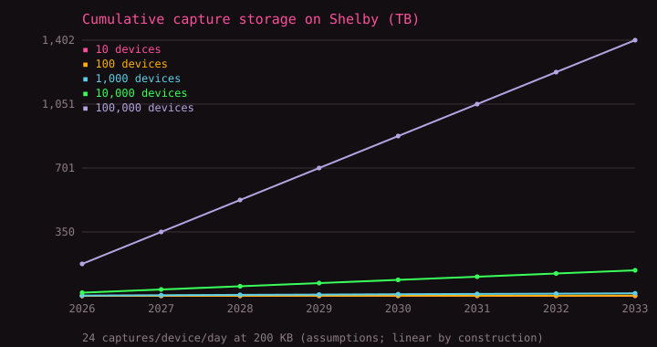
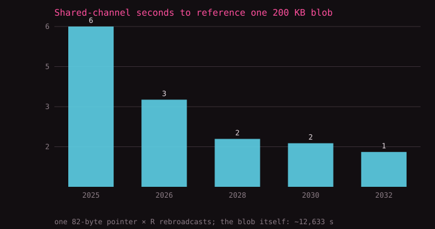

# Shelby × LoRa: scaling relationships, 2025–2033

Generated by `analysis/mesh_shelby_scaling.py` — a parameterized model,
not a forecast. Measured inputs: R = 7.36 for a flooded mesh (Meshtastic's
own simulator), the architecture ladder from the DePIN verification report,
LongFast airtime from the Semtech symbol budget, and the 82-byte `SHLB`
pointer from docs/shelby-pointer-format.md. Everything else is a labeled
assumption at the top of the script.

## A. The mesh can always afford the pointer

A pointer is 82 bytes — 846 ms on the air at LongFast. Even
after the mesh pays its rebroadcast tax, one collision domain carries
thousands of pointers a day at every step of the architecture ladder:

| Year | Architecture | R | Pointers/hour | Pointers/day | Text msgs/hour |
| ---: | --- | ---: | ---: | ---: | ---: |
| 2025 | managed flood (Meshtastic today) | 7.36 | 116 | 2,776 | 62 |
| 2026 | source routing (MeshCore shipped) | 4.0 | 213 | 5,107 | 114 |
| 2028 | scheduled access (TDMA/slotted) | 2.2 | 871 | 20,894 | 465 |
| 2030 | multi-channel reuse (4 slots) | 2.0 | 3,831 | 91,934 | 2,047 |
| 2032 | spatial reuse (sector relays) | 1.6 | 13,168 | 316,023 | 7,035 |

At 30 nodes per collision domain, a 100,000-node mesh is
~3,333 domains, so even today's flood architecture moves
**9.3M pointers a day**
network-wide. The bottleneck for off-grid Shelby was never announcing the
blob — it is and remains moving the blob's bytes, which is what gateways
are for.

## B. Captures accumulate on Shelby

Each Lilyshark device saves ~24 session captures/day at
~200 KB each (assumptions). Storage is immutable and
content-addressed, so it only grows; reads multiply it (analysis,
sharing — modeled at 5 serves per blob):

| Devices | GB written/yr | TB after 3 yrs | Blobs/yr | GB served/yr |
| ---: | ---: | ---: | ---: | ---: |
| 10 | 18 | 0.05 | 87,600 | 88 |
| 100 | 175 | 0.53 | 876,000 | 876 |
| 1,000 | 1,752 | 5.26 | 8,760,000 | 8,760 |
| 10,000 | 17,520 | 52.56 | 87,600,000 | 87,600 |
| 100,000 | 175,200 | 525.60 | 876,000,000 | 876,000 |

Shelby compensates *serving*, not idle storage — and a capture archive is
exactly serve-heavy: small writes, repeated reads by analysts and gateways.

## C. Why the radio carries a reference, never the payload

Announcing one 200 KB blob costs the mesh one pointer × R
rebroadcasts. Sending the blob itself would take 844 max-size
frames — **12,633 seconds of shared channel time** under
today's flood, versus 6.2 seconds for the pointer.
The ratio only improves as R falls:

| Year | Architecture | Airtime per blob (s) | Airtime per MB (s) | IP bytes per air byte |
| ---: | --- | ---: | ---: | ---: |
| 2025 | managed flood (Meshtastic today) | 6.23 | 31.1 | 331 |
| 2026 | source routing (MeshCore shipped) | 3.38 | 16.9 | 610 |
| 2028 | scheduled access (TDMA/slotted) | 1.86 | 9.3 | 1,109 |
| 2030 | multi-channel reuse (4 slots) | 1.69 | 8.5 | 1,220 |
| 2032 | spatial reuse (sector relays) | 1.35 | 6.8 | 1,524 |

The asymmetry is the design: every year the mesh gets better at carrying
pointers, and nothing makes it better at carrying payloads — airtime stays
scarce by physics. The 82-byte pointer is the permanent interface; the
architecture ladder just makes it cheaper to use.
