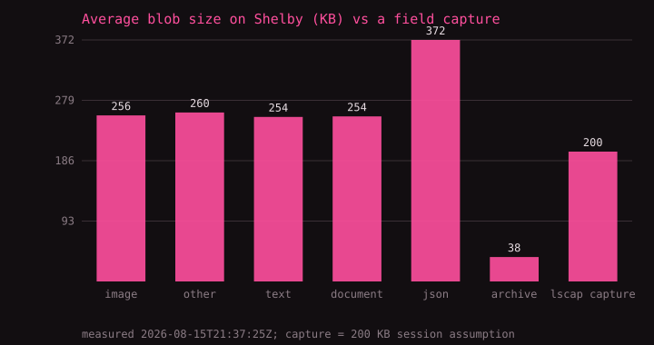

# Evidence from the live Shelby network

Snapshot: 2026-08-15T21:37:25Z (Early Access testnet, via the public indexer that
backs lilyshark.vercel.app). Regenerate with
`python3 analysis/shelby_network_evidence.py`. These are measured values from
the running network, not model outputs.

## The network is real and economically active

| Measure | Value |
| --- | ---: |
| Blobs stored | 393,000 |
| Data stored | 108.20 GB |
| Unique blob owners | 48,272 |
| Indexer activity records | 3,529,910 |
| Activities per blob | 9.0 |
| ShelbyUSD transactions (all time) | 8,087,316 |
| ShelbyUSD volume (all time) | 251,541 |
| Transfers in the last 24 h | 26,851 |
| ShelbyUSD volume (24 h) | 647.68 |
| Average transaction | 0.031 ShelbyUSD |

A storage network with payment rails that are already exercised millions of
times is what the capture archive and the off-grid pointer need: not a
promise of infrastructure, but running infrastructure.

## The network's average object is already capture-sized

The average blob on Shelby today is **275 KB**. A Lilyshark
field-session capture is ~200 KB; the demo capture in this
repo is 4.7 KB. Captures are not an unusual
object for this network — they sit squarely in its existing workload:

| Content type | Blobs | GB stored | Share | Avg size |
| --- | ---: | ---: | ---: | ---: |
| image | 129,751 | 33.21 | 33.0% | 256 KB |
| other | 66,805 | 17.39 | 17.0% | 260 KB |
| text | 65,618 | 16.63 | 16.7% | 254 KB |
| document | 65,510 | 16.66 | 16.7% | 254 KB |
| json | 65,305 | 24.30 | 16.6% | 372 KB |
| archive | 11 | 0.00 | 0.0% | 38 KB |

Each blob also accrues ~9 activity records — the
write-once, act-on-repeatedly pattern of an archive that gets read, shared,
and referenced, which is the pattern Shelby's serving compensation rewards.

## What this supports

- **Captures belong here.** Immutable, content-addressed, retrievable by
  name — and the network's median workload is already objects of this size
  and access pattern.
- **The 82-byte pointer references something real.** A pointer names a blob
  on a network that provably holds hundreds of thousands of them and meters
  their movement in a live unit of account.
- **Serving is measured.** The `blob_activities` indexer (3,529,910 records) is
  the raw material for paying gateways that resolve pointers — the work the
  grant would fund is instrumentable end to end.
