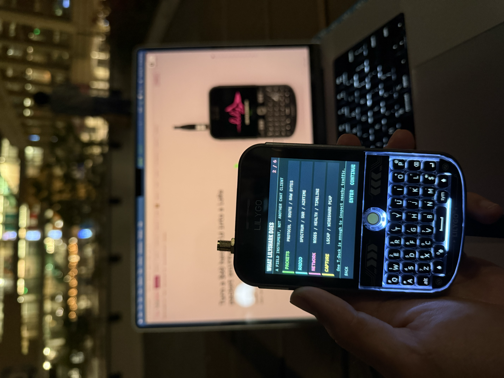
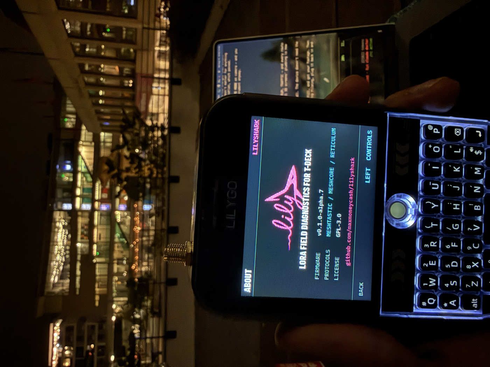
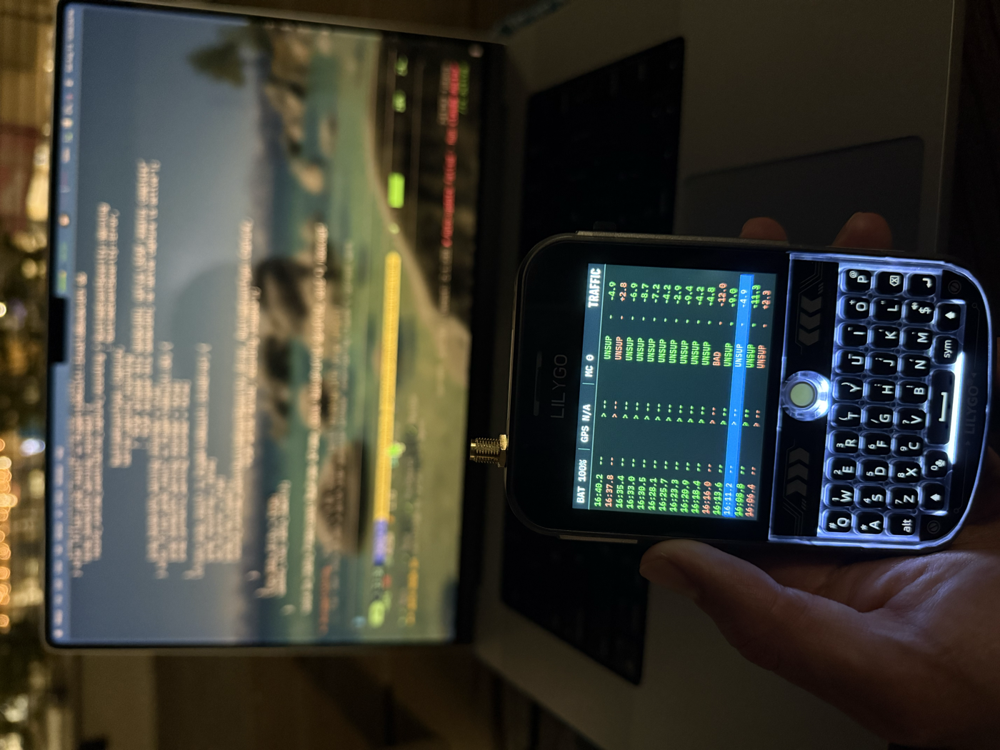

# Lilyshark on real hardware

Every simulator screenshot in these docs is pixel-locked to the firmware, but
a locked render is still a promise. These photos are the promise kept: a
LILYGO T-Deck Plus running Lilyshark `v0.1.0-alpha.7`, flashed from the
merged factory image on 2026-08-15, first field session that same night.

The guided first run, mid-tour. The device explains its four diagnostic
groups — packets, radio, network, capture — before any configuration is
asked for. Behind it, the web analyzer's intro page is cycling the same
firmware screens the device renders.

The About screen on hardware: `v0.1.0-alpha.7`, the three supported protocol
families, GPL-3.0, and the repository address. What the simulator renders is
what the panel shows — same layout engine, same fonts, same 320×240.

The Traffic screen streaming in **simulate mode** — the deterministic
synthetic channel the firmware generates on-device for bench work and
demonstrations (always labeled, always logged as an event; see the
[quickstart](quickstart.md)). Battery, GPS state, and capture status ride in
the top bar; RSSI develops per-row exactly as it does for received frames,
because synthetic traffic enters through the same ingest path the SX1262
uses.
