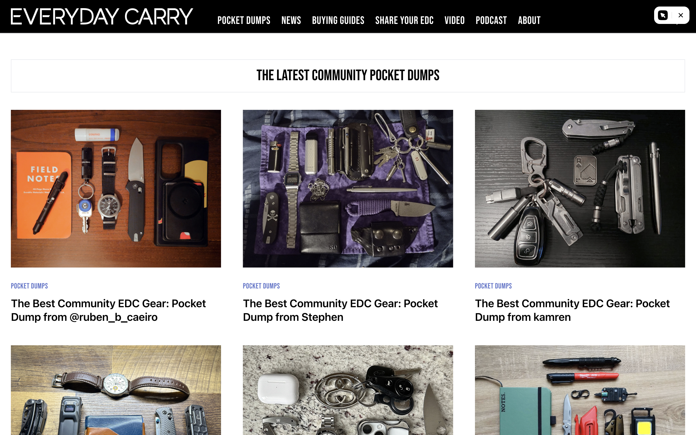
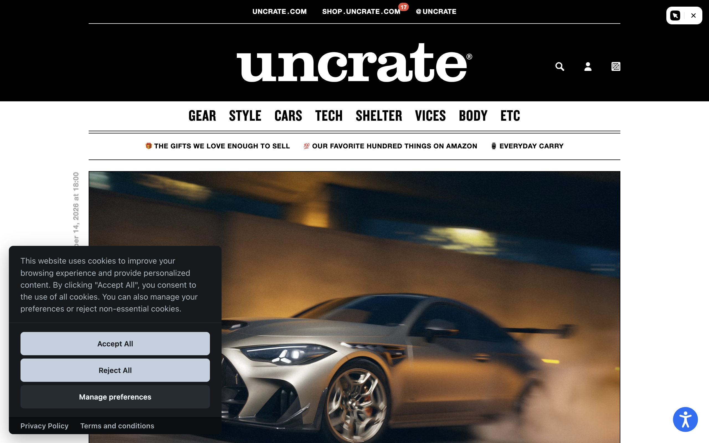
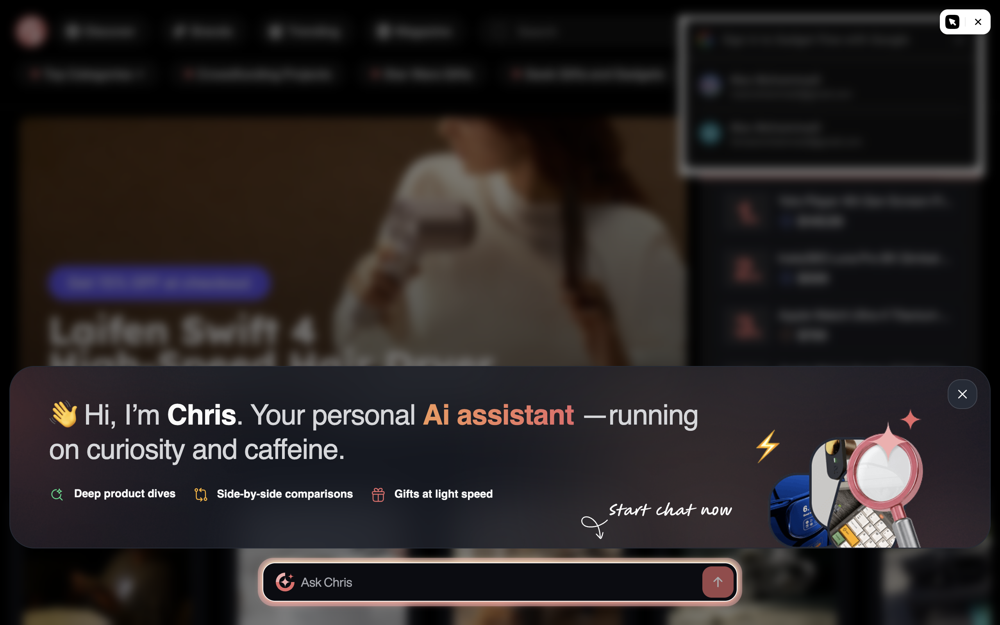
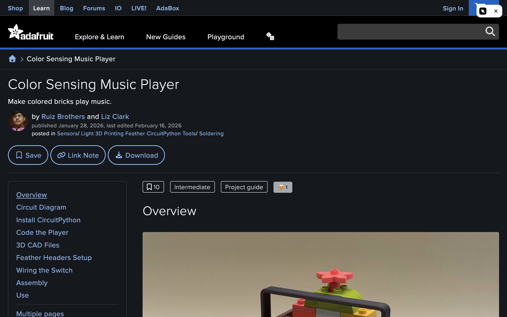

# Competitor UI observations

Captured September 14, 2026 in the existing Arc browser through Playwriter. These are desktop observations of the pages encountered in this session, not a mobile audit, controlled conversion study or claim about every visitor's experience. The small white control at the upper right is browser automation tooling.

## Everyday Carry: people and their objects first

[Live homepage](https://everydaycarry.com/) · [Full capture](competitor-screens/everyday-carry.png)

The first content section is community pocket dumps. A three-column grid gives photographs most of the space, with creator names in the titles. Sharing is available in navigation while visitors can immediately browse other people's work. New releases and shopping links also appear in the page's accessible content.

**Apply:** lead with actual projects and identifiable makers. A contribution request should accompany something visitors already want to explore. Long repeated title prefixes consume space that could describe what makes a setup interesting.

## Uncrate: strong object photography, substantial brand chrome

[Live homepage](https://uncrate.com/) · [Full capture](competitor-screens/uncrate.png)

The captured page uses a very large masthead and category navigation above a large photograph. Its accessible content couples short descriptions with reading, merchant and Uncrate Supply links. A cookie prompt covers the lower-left portion in this visit.

**Apply:** the photographic direction and concise path from a story to a purchase are useful references. Its substantial header is not evidence that our oversized wordmark is effective; for gadgets.sh, we should test getting the working object and its explanation into view sooner. The screenshot captures the prompt as encountered, rather than a cleaned marketing image.

## Gadget Flow: abundant discovery tools and an interrupting introduction

[Live homepage](https://thegadgetflow.com/) · [Full capture](competitor-screens/gadget-flow.png)

The initial accessible page exposed search, categories, a featured carousel, prices, reminders and collection actions. By the screenshot, an AI-assistant introduction obscured and blurred the page. The capture therefore documents an overlay, not an unobstructed layout reference. No chat was sent.

**Apply:** discovery tools are common competitive features. An interruption before a visitor experiences a useful object can compete with the main task. Our first experiment should show its value directly; an assistant needs a demonstrated user job before taking prominent space.

## Adafruit: a complete project with direct routes to implementation

[Live project](https://learn.adafruit.com/color-sensing-music-player?view=all) · [Full capture](competitor-screens/adafruit-project.png)

The project opens with a literal outcome, named authors and dates. Save, reference and download actions sit above a contents sidebar linking directly to circuitry, firmware, code, CAD and assembly. Product links and Add to Cart actions occur in the page's accessible content. The demonstration begins lower in this captured viewport.

**Apply:** use the same clarity about authorship and implementation requirements. For a discovery-led experience, give the finished result more immediate room, then retain direct navigation for experienced builders. Shoppable technical instructions already have a strong precedent here.

## Design requirements to test

1. A visitor can see a real device doing something and understand the result on the first screen.
2. Several discoveries are easy to browse without a platform introduction or login requirement.
3. Project details clearly distinguish a photographed object, a tested result and a future concept.
4. Exact parts, firmware, limitations and source code are easy to reach.
5. Creator credit travels with a shared project or adaptation.
6. A purchase action corresponds to a real merchant link or fulfillable offer.

These observations inform the [business and product recommendation](competitive-strategy-2026-09-14.md). They do not establish which layout will convert better; that requires testing with the target audience and real content.
